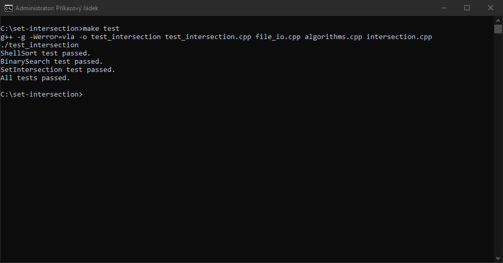
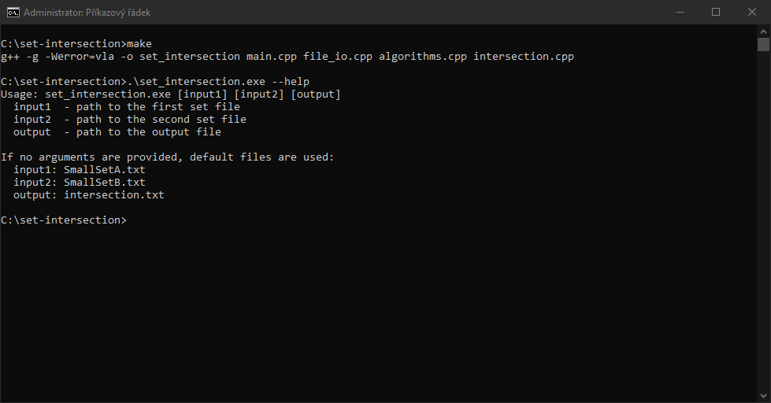
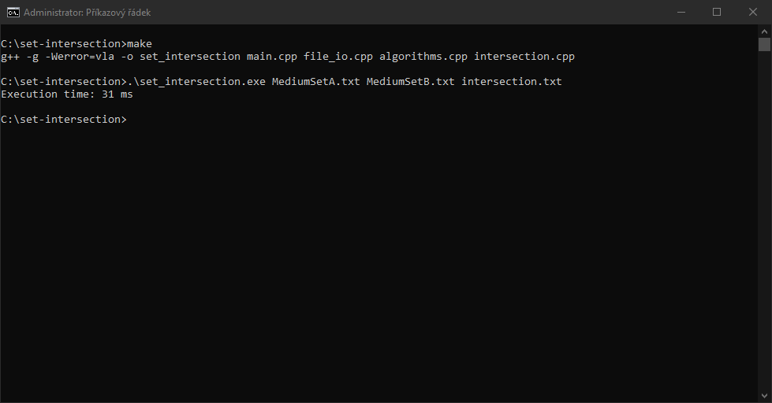
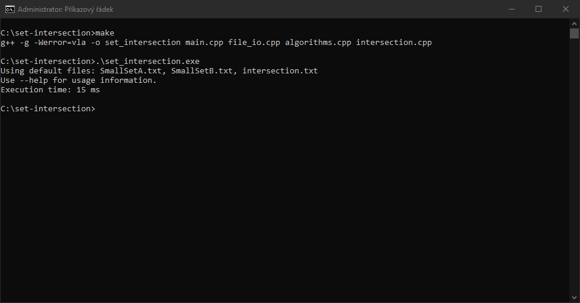

# Set Intersection

Console application that computes the intersection of two sets using Shell sort and binary search algorithms.

## Tech stack

- Language: C++
- Build: Makefile
- Documentation: Doxygen

## Usage

Default files:
```sh
make && .\set_intersection.exe
```

Custom files:
```sh
.\set_intersection.exe input1.txt input2.txt output.txt
```

Help:
```sh
.\set_intersection.exe --help
```

## Tests
```sh
make test
```

## Documentation
```sh
doxygen Doxyfile
```

## Screenshots




